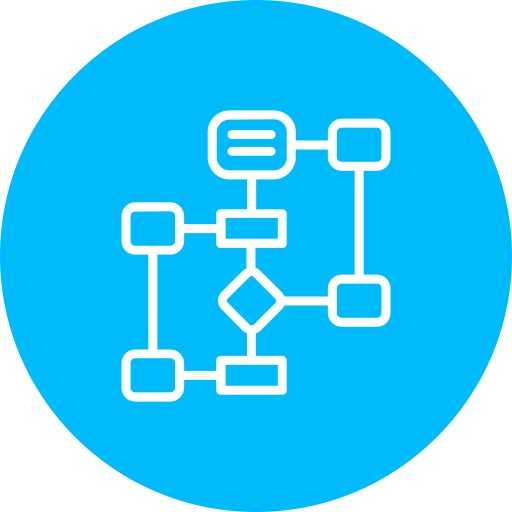

    
  

  <h1 align="center">Pynar Flowchart</h1>
  <!-- TABLE OF CONTENTS -->
  <h2 id="table-of-contents">:book: Table of Contents</h2>
  

    
Table of Contents

    <ol>
      <li><a href="#about-the-project"> ➤ About The Project</a></li>
      <li><a href="#overview"> ➤ Overview</a></li>
      <li><a href="#howtoinstall"> ➤ How to Install</a></li>
      <li>
        <a href="#project-files-description"> ➤ Project Files Description</a>
      </li>
      <li><a href="#Credits"> ➤ Credits</a></li>
    </ol>
  

  
  
  
  <!-- ABOUT THE PROJECT -->
  <h2 id="about-the-project">:pencil: About The Project</h2>
  
  

    As using Python, Qt framework, Pdf.js, flowchart.js, we can create our own flowchart maker.
  

  
  <ul>
    <li>
        The program only accept python code.
    </li>
    <li>The flowchart generating algorithm is designed by dstang2000 <a href="https://pypi.org/project/py2flowchart">py2flowchart</a>.</li>
    <li>All performed operations can be viewed via a GUI(Python->Qt).</li>
  </ul>
  
  
  
  <!-- OVERVIEW -->
  <h2 id="overview">:cloud: Overview</h2>
  
  

     As you write code, you might like to see the flowchart of the code. So Pynar flowchart maker is designed for it.
     
     The idea of designing flowchart maker that we can use in our own applications can be implemented quite successfully.
  

  
    <h2 id="howtoinstall">⛓️ How to install</h2>
  
  

    There are two ways to deal with it:
  <ol>
    <li>Build an executable file with Pylance</li>
      <ul>
         <li> Open the location where all the documents are located.</li>
         <li> Click the right button while pressing the Shift key.</li>
         <li> You can see "Open powershell window here" .</li>
         <li> pip install -r requirements.txt </li>
         <li> pyinstaller --onefile -w -i  .\Flowchart.png .\main.py</li>
         <li> Run these lines of code with Shell in this order..</li>
         <li> You can see that executable file in dist folder in that folder</li>
      </ul>
    <li>Run Main(main.py) file with IDE</li>
   </ol>
  

  
  
  <!-- PROJECT FILES DESCRIPTION -->
  <h2 id="project-files-description">📝: Project Files Description</h2>
<ul>
    <li><b>main.py</b> - Where all the main classes.</li>
    <li><b>flowchart.js</b> - Where main js file for creating charts.</li>
    <li><b>icons_rc.py</b> - Where all resources(icons,backgrounds etc.) object code module generated from reading qrc file, res_rc.qrc .</li>
    <li><b>flow.py</b> - Where all the flowchart generating algorithms.</li>
    <li><b>Flowchart.png</b> - Where main icon</li>
    <li><b>Pdfpreview</b> - Where all resources(icons, html, css, js etc.) which are created by Mozilla, for viewing pdf with pdf.js.</li>
    <li><b>Help</b> - Where all resources(icons, html, py, md etc.) for help files.</li>
  </ul>

  <!-- CREDITS -->
  <h2 id="Credits">:scroll: Credits</h2>
    <h3>Important<h3>
   

   The codes in this repo were developed with the support of TÜBİTAK (Scientific and Technological Research Council of Turkey) within the scope of the project numbered 118E882, “Developing a Turkish Python code editor with intelligent agents based interactive help system that can analyse syntax errors of users ”. It cannot be used commercially. 
   

   
  
  

